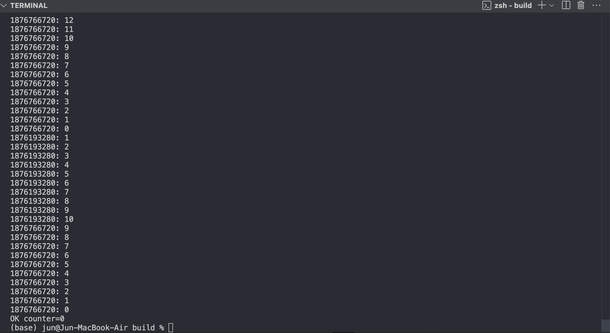

## 개요
생산자/소비자 문제를 condition varaible를 사용하여 구현 및 해결하였습니다.

## 문제해결 방법
이 문제는 생산자/소비자 문제 중 Bounded buffer problem으로 x의 값을 현재 버퍼의 가용 가능한 크기로서 고려하여 0부터 30까지의 범위를 가질 수 있도록 제한하였습니다.

또한, 생산자/소비자 문제는 Blocked-awake 방법으로 동작하므로 두 개의 condition variable로 empty와 fill 변수를 사용하였습니다.

생산자인 경우 버퍼에 put이 가능한 경우에만 x++;를 진행하고 그렇지 않다면 비어질 때까지 go to sleep하러 갑니다. 반면, 소비자인 경우 버퍼에 get이 가능한 경우 x--;를 진행하고 그렇지 않다면 채워질 때까지 go to sleep하러 갑니다. 각각 put과 get을 진행한 뒤에는 서로를 awake하기 위한 pthread_cond_signal(&fill);, pthread_cond_signal(&empty);를 실행하여 서로에게 알립니다.

더불어, 전역변수 x를 상호배제 하기 위해서 임계 영역의 시작과 끝에 pthread_mutex_lock(&mutex);, pthread_mutex_unlock(&mutex);를 사용하여 guard를 하였습니다.

## 구현결과(스냅샷)
**1.개발환경**
운영체제: macOS Sequoia 15.5
프로세서: Apple M1
편집도구: Visual Studio Code v1.101.0
빌드도구: cmake v3.31.6
C++ 컴파일러: Apple clang v16.0.0

**2.빌드 방법**
1. Create a build directory:
   ```bash
   mkdir build && cd build
   ```

2. Compile your source code:
   ```bash
   cmake ..
   ```

3. Run make:
   ```bash
   make
   ```

4. Run the executable
    ```bash
    ./Producer_Consumer_Sol_Condition_Variable
    ```

5. Etc./ shortcut command:
   ```
   cmake .. && make && ./Producer_Consumer_Sol_Condition_Variable
   ```

**3.실행 결과(일부분)**


## 평가
- x의 값은 0부터 30사이의 범위 내에서 정확하게 출력된다.
- 전역 변수 x에 접근하는 생산자, 소비자 함수 내에서 각 임계영역에 대한 Race condition이 발생하지 않으며 프로그래머가 의도한 대로 correct한 execution ordering을 보장한다.
- 생산자와 소비자는 각각 조건변수인 empty, fill를 사용한 Blocked-awake 기작이 정상적으로 작동되며 불필요한 busy-waiting 없이 동작한다.
- mutex, empty, fill에 대한 초기화 및 메모리 할당 해제가 적절하게 이루어지고 있다.

## 결론 및 느낀점
Race condition 문제를 조건변수를 사용한 생산자/소비자 문제로 해결하면서 제가 의도한 대로 correct한 execution ordering이 이루어지는 과정을 통해 언제 상호배제가 필요한지, 어떠한 방법으로 해결 가능한 건지를 알게 되었고 자신감이 생기게 되었습니다.