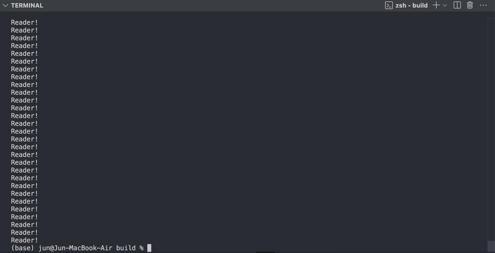

## 개요
Readers/Writers 문제를 Reader preference 버전과 Writer preference 버전으로 각각 구현하였다.

[깃허브 바로가기](https://github.com/logicallaw/INHA_OperatingSystem_003/tree/main/src/readers_writers_problems)

## 문제해결 방법
**1.Reader preference**
Reader preference 버전은 Writer보다 Reader에게 우선권을 주는 알고리즘이다. 

first reader가 wsem을 잡게 되면 last reader가 wsem을 풀기 전까지 writer는 무한정 대기하도록 reader에게 우선권을 주도록 구현하였다.

이러한 방법은 writer의 unbounded delay로 인한 starvation을 겪게 되는 문제가 존재한다.

**2.Writer preference**
Writer preference 버전은 Reader보다 Writer에게 우선권을 주는 알고리즘이다. 

first writer가 rsem을 잡게 되면 last writer가 rsem을 풀기 전까지 reader는 무한정 대기하도록 writer에게 우선권을 주도록 구현하였다.

또한, rsem에서 reader와 writer가 경쟁하지 않도록(대등하게 대기 하지 않도록) reader 부분에서 reader는 z에서 대기하도록 함으로써 coner case를 고려하여 작성하였다.

## 구현결과(스냅샷)
**1.개발환경**
운영체제: macOS Sequoia 15.5
프로세서: Apple M1
편집도구: Visual Studio Code v1.101.0
빌드도구: cmake v3.31.6
C++ 컴파일러: Apple clang v16.0.0

**2.빌드 방법**
1. Create a build directory:
   ```bash
   mkdir build && cd build
   ```

2. Compile your source code:
   ```bash
   cmake ..
   ```

3. Run make:
   ```bash
   make
   ```

4. Run the executable (e.g. ReaderPreference):
    ```bash
    ./ReaderPreference
    ```

5. Etc./ shortcut command:
   ```
   cmake .. && make && ./ReaderPreference
   ```

**3.실행 결과(일부분)**
- Reader preference


- Writer preference


## 평가
**1.Reader preference**
- 제약조건에 따른 Writer는 단독접근, Reader는 동시접근 하도록 설계되었다.
- Reader preference에 따른 first reader는 wsem을 잡도록, last reader는 wsem을 풀도록 구현되었다.
- 공유자원인 readercount에 대한 상호배제가 적절하게 수행되었다.
- 이러한 알고리즘은 writer의 unbounded delay로 인한 starvation이 발생할 수 있음을 시사한다.

**2.Writer preference**
- 공유자원인 readercount는 세마포어 x에 의한 상호배제가 이루어지고, writercount는 세마포어 y에 의한 상호배제가 적절하게 처리되었다.
- 세마포어 rsem에서 reader와 writer가 경쟁하지 않도록 reader부분에서 세마포어 z에서 대기하도록 함으로써 coner case를 고려하여 적절하게 설계되었다.
- 각 readers와 writers 함수에서 각 세마포어 변수에 대한 blocked-awake가 적절하게 적용되어서 영원히 blocked되는 문제 없이 작성되었다.

## 결론 및 느낀점
**1.결론**
문제의 요구사항에 맞게 각각 Reader와 Writer의 preference 알고리즘을 구현하였다. Writer preference인 경우 coner case까지 고려한 설계를 바탕으로 유지보수 및 안전성을 높였다.

**2.느낀점**
모두가 Writer인 Producer/Writer 문제와 다르게 Reader와 Writer별 각각 고려해야될 조건들과 coner case까지 고려해보면서 세마포어를 사용한 상호배제 방법을 깊이 이해할 수 있게 되었고 특정 조건에서는 starvation 발생하고 이를 해결하는 방법까지 모두 익히게 되었습니다.
