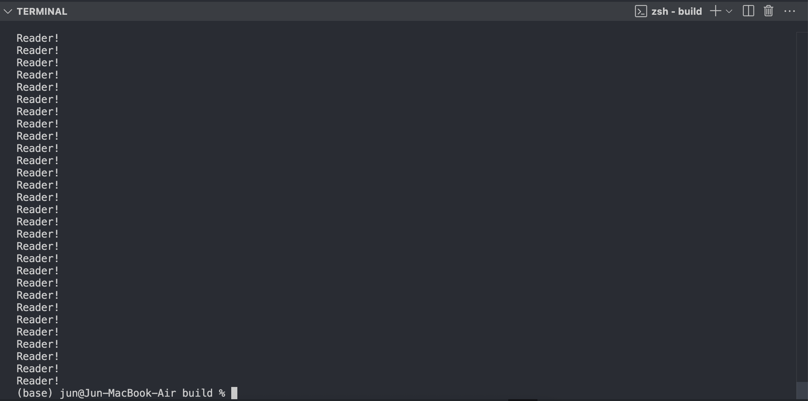

## 개요
Readers/Writers 문제를 Reader preference 버전과 Writer preference 버전으로 각각 구현하였습니다.

[깃허브 바로가기](https://github.com/logicallaw/INHA_OperatingSystem_003/tree/main/src/readers_writers_problems)

## 문제해결 방법
**1.Reader preference**

**2.Writer preference**

## 구현결과(스냅샷)
**1.개발환경**
운영체제: macOS Sequoia 15.5
프로세서: Apple M1
편집도구: Visual Studio Code v1.101.0
빌드도구: cmake v3.31.6
C++ 컴파일러: Apple clang v16.0.0

**2.빌드 방법**
1. Create a build directory:
   ```bash
   mkdir build && cd build
   ```

2. Compile your source code:
   ```bash
   cmake ..
   ```

3. Run make:
   ```bash
   make
   ```

4. Run the executable (e.g. ReaderPreference):
    ```bash
    ./ReaderPreference
    ```

5. Etc./ shortcut command:
   ```
   cmake .. && make && ./ReaderPreference
   ```

**3.실행 결과(일부분)**
- Reader preference


- Writer preference


## 평가
**1.Reader preference**

**2.Writer preference**

## 결론 및 느낀점
**1.Reader preference**

**2.Writer preference**
